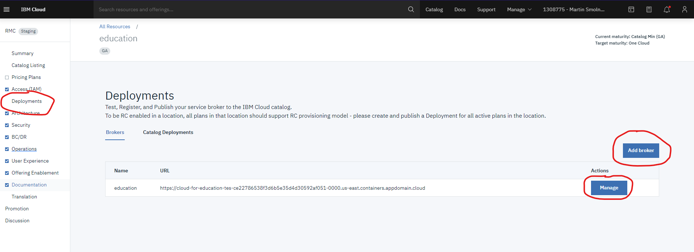

# Open Service Broker Reference App

## Overview
Every [service onboarding in IBM Cloud Catalog](https://cloud.ibm.com/docs/sell?topic=sell-overview) requires to build a broker app that follow the [Open Service Broker](https://github.com/openservicebrokerapi/servicebroker/blob/v2.12/spec.md) (OSB) spec. This project provides an quick setup _reference broker_ implementation. 

As you onboard through [Partner Center](https://cloud.ibm.com/partner-center/sell) , you will be required to provide your broker app URL. This readme provides a step by step guide on how to configure and deploy a reference broker app that hooks up to your service and helps you test an end to end flow early in the onboarding process. This is all done with the help of the CLI makefile automation that performs the following tasks for you:

 - builds the Java based OSB broker code using maven  
 - builds a docker container image of the OSB broker app, 
 - creates an IBM Container Registry (ICR) namespace (if it does exist) and uploads the image to the ICR namesapce 
 - deploys the app on IBM Code Engine

> Note that this broker is not recommended to be used in production. It to be used as a reference to help you build your production broker

## Whats is an Onboarding and a Deployment IBM Cloud Account
In the sections to follow you will come across many references to Onboarding and Deployment IBM Cloud account. This section tries do demystify the two.

#### _Onboarding IBM Cloud Account_ 
is the IBM Cloud account under which your service is being onboarded. The will be the cloud account selection when you are working with Partner Center.

> Note to IBMers: If you are an IBMers, very likely while you will  be onboarding via **test**.cloud.ibm.com, your Deployment IBM Cloud account MUST be **cloud.ibm.com**.

#### _Deployment IBM Cloud Account_ 
is the cloud account under which you will be deploying your broker app using  Code Engine. You Deployment Cloud Account could be same as your Onboarding Cloud account as long as the account is on cloud.ibm.com (IBM Cloud Production)

> Note to IBMers: The Deployment  cloud account **MUST** be an account in **cloud.ibm.com** and **NOT** in test.cloud.ibm.com or any other flavor of IBM cloud. This implies, the IBM Container registry, namespace and the IBM Code Engine app to be deployed in the sections to follow have to be on  cloud.ibm.com

## Prerequisites

1.  #### [Docker](https://docs.docker.com/engine/install/) setup locally on your computer
2. #### IBM Cloud Access
    The following privileges are required 
    1. You have to be invited to the IBM Cloud account where the service is being on-boarded
    2. You will need the following access in the  Deployment IBM Cloud Account 
        
        a. Writer and Editor access to IBM Container Registry

        b. Editor access to IBM Cloud Code Engine
        
        Search your user and verify you have the required access [here](https://cloud.ibm.com/iam/users) 
    3. You have to be added to the service in the [Global catalog](https://globalcatalog.cloud.ibm.com) (via the Visibility tab in the UI)

<!-- 3. IBM Container Registry namespace

    The CLI automation requires an IBM Container Registry namespace to be provided in the config property - `BROKER_ICR_NAMESPACE_URL`. This is the namespace into which the OSB container image will be uploaded. Look for available namespaces [here](https://cloud.ibm.com/registry/namespaces). If you do not have a namespace you can use, we will create one for you, simply provide a unique name in the `build.config.properties` for your namespace in the _Building the Broker_ section below. 
    follow these [instructions](https://cloud.ibm.com/docs/Registry?topic=Registry-getting-started#gs_registry_namespace_add) to create one. -->

## Create IBM Cloud API keys

  The project expects 3 IBM Cloud API keys. Two are covered in this section and the third one in the next section. 

  - **ONBOARDING_IAM_API_KEY**

    is the API key created in cloud account where the SaaS service is being onboarded via Partner Center. The API key will used to access [Global Catalog](https://globalcatalog.cloud.ibm.com) API
    
  - **DEPLOYMENT_IAM_API_KEY**

    is the IBM cloud API key created in cloud account where the broker is to be deployed. The API key (and therefore the user owning the API key) must have the following access in the  Deployment IBM Cloud Account 
      
      a. Writer and Editor access to IBM Container Registry

      b. Editor access to IBM Cloud Code Engine 
    
    Find your user and verify you have the required access [here](https://cloud.ibm.com/iam/users)

    You may follow [this](https://cloud.ibm.com/docs/account?topic=account-userapikey&interface=ui#create_user_key) document to create the API keys. Once created, save the API key values to a safe location on your local machine.  

  - **METERING_API_KEY**

    The Reference Broker provides a dashboard that allows you to send test metering data to BSS for your service. To be able to do so your metering Service ID and API key need to be setup.  
    If you are onboarding via [Partner Center](https://cloud.ibm.com/partner-center/sell), 
    - Navigating to _My products -> Dashboard_ 
    - Click on the _Create Service ID_ button
    - Create an API key for the Service ID using the _Create API key_ link on the same page. 
    
    Note down the API Key as this will be used as METERING_API_KEY during the deploy step   

    <!-- If you are onboarding via RMC, the Service ID is created from the _Access (IAM)_ page. Once created, find your service it listed [here](https://cloud.ibm.com/iam/serviceids). Next, click the 3 dot menu and click _Unlock_ to unlock the serviceID for BSS. Next, got ot the API Keys tab and create an API key for it. Note down the API Key as this will be used as METERING_API_KEY during the deploy step    -->

## Building the Broker

 ### 1. Clone the repo and cd into the directory

    git clone https://github.com/IBM-Cloud/onboarding-osb.git
    cd onboarding-osb

### 2. Complete the [`deploy/build.config.properties`](deploy/build.config.properties) config
Complete the properties file with the instructions provided below and export as environment variables 

   <!-- >   Note: If you do not wish to export the properties as environment variables, the deploying will still work as long as the properties are set in this properties file(s) 
   > Note: Environment variables take precedence over properties set in the config.properties -->

  - #### ONBOARDING_ENV
    - is set to `stage` if the IBM Cloud Onboarding is on test.cloud.ibm.com (used by IBMers) or `prod` if the IBM Cloud Onboarding is on cloud.ibm.com
  - #### GC_OBJECT_ID
    <!-- - To fetch catalog.json -->
    - In Partner Center, this value can be found in the Brokers tab. Additional help is available by clicking the _Open the guide_ button in the Broker tab 
    <!-- - To find it in RMC 
      - Go to Resource Management Console  -> _Summary_ page and copy the value of ID field under the _Service details_ section. Example RMC summary page url: `https://cloud.ibm.com/onboarding/summary/[your-service]` -->
  - #### BROKER_ICR_NAMESPACE_URL
    - This is the IBM Container Registry namespace in the [Deployment Cloud Account](#deployment-ibm-cloud-account) where the OSB container image will be uploaded. You may choose one of the available namespaces [here](https://cloud.ibm.com/registry/namespaces)
    
      If you do not want to use an exisitng namespace, simply provide a unique name and the automation will create one for you. If you would like to create it manually please follow [these](https://cloud.ibm.com/docs/Registry?topic=Registry-registry_setup_cli_namespace) instructions and provide the name
    - eg. `us.icr.io/yournamespace`
  - #### ICR_IMAGE
    - is the name for the broker container image that will be pushed on ICR namespace in the [Deployment Cloud Account](#deployment-ibm-cloud-account)
    
      eg. `broker-img`
  - #### ICR_NAMESPACE_REGION
    - is the region in which the namespace is created (or is to be created). The region can be found [here](https://cloud.ibm.com/registry/start)

      eg. `us-south` for Dallas, `eu-central` for Frankfurt
  - #### ICR_RESOURCE_GROUP
    - is the resource group under which ICR namespace exists (or will be created). The resource group name can be found [here](https://cloud.ibm.com/registry/namespaces)
      eg. `Default`
     

### 3. Set the variables in your environment using:

    
    export $(cat deploy/build.config.properties)

     
### 4. Build the broker:

Running the below command in your terminal will maven build your broker, package it as a container image and upload it to IBM Container Registry in the namespace you provided.

    DEPLOYMENT_IAM_API_KEY=replace-with-your-DEPLOYMENT_IAM_API_KEY ONBOARDING_IAM_API_KEY=replace-with-your-ONBOARDING_IAM_API_KEY make build

> Note: When prompted, enter your local computer's password. 
  
*Congratulations!* We now have the broker application image.  
Log in to IBM Cloud and look under [ICR namespaces](https://cloud.ibm.com/registry/namespaces) to find your image. 

Our next step now is to deploy the broker application image we just created. The CLI tool we provide supports deployment to [IBM Cloud Code Engine](https://www.ibm.com/cloud/code-engine). Based on the platform of your choice, just to the next appropriate section section

## Deploying the Broker on IBM Cloud Code Engine

### 1. Complete the [`deploy/ce/ce.config.properties`](deploy/ce/ce.config.properties) config 
Complete the properties file with the instructions provided below and export as environment variables    
  - #### APP_NAME
    - is the application name you would like to give the broker on Code Engine.  Try using a unique identifier in the name so that you dont run into conflicts.  
  - #### ONBOARDING_ENV
    - is set to `stage` if the IBM Cloud Onboarding is on test.cloud.ibm.com (used by IBMers) or `prod` if the IBM Cloud Onboarding is on cloud.ibm.com 
  - #### BROKER_USERNAME
    - is the username you would like  to set for the Broker
  - #### BROKER_PASSWORD
    - is the password you would like to set for the Broker 
    > Note: The BROKER_USERNAME and BROKER_PASSWORD values provided here also need to be configured in Partner Center when publishing the broker.
  - #### BROKER_ICR_NAMESPACE_URL
    - use the same namespace URL provided in `deploy/build.config.properties` during the build step
    - eg. `us.icr.io/yournamespace`
  - #### ICR_IMAGE
    - use the same image name provided in `deploy/build.config.properties` during the build step
  - #### CE_PROJECT
    - Select a project from the [list of available projects](https://cloud.ibm.com/codeengine/projects). You can [create a new one](https://cloud.ibm.com/docs/codeengine?topic=codeengine-manage-project#create-a-project) yourself or give us a name and we will create one for you. 
  - #### CE_REGION
    - Set region for IBM Code Engine deployment. This is value in the `Location` column from the [list of available projects](https://cloud.ibm.com/codeengine/projects) you would be using to create the app into. 
  - #### CE_RESOURCE_GROUP
    - Select resource group to target for IBM Code Engine. This is value in the  `Resource group` column from the [list of available projects](https://cloud.ibm.com/codeengine/projects) you would be using to create the app into. 
  - #### CE_REGISTRY_SECRET_NAME
    - Select an exisitg registry access from your project or [create one](https://cloud.ibm.com/docs/codeengine?topic=codeengine-add-registry#add-registry-access-ce)
  - #### PC_URL [optional]
    - Partner Center url for dashboard. use [this](https://cloud.ibm.com/partner-center/sell) to see your applications and copy url.

    
### 2. Export the variables in your environment

    export $(cat deploy/ce/ce.config.properties)

### 3. Deploy to IBM Code Engine

Running the below command in your terminal will deploy your app to IBM Code Engine. If you have not yet created the required API keys refer to section on [IBM Cloud API keys](#ibm-cloud-api-keys)

    DEPLOYMENT_IAM_API_KEY=replace-with-your-DEPLOYMENT_IAM_API_KEY  METERING_API_KEY=your-replace-with-your-METERING_API_KEY make deploy-ce

 

## Building and deploying in a single command 

The CLI tool also provides a single command that both builds and deploys the the broker app   
 
 For Code Engine:

    DEPLOYMENT_IAM_API_KEY=replace-with-your-DEPLOYMENT_IAM_API_KEY ONBOARDING_IAM_API_KEY=replace-with-your-ONBOARDING_IAM_API_KEY METERING_API_KEY=your-replace-with-your-METERING_API_KEY make build-deploy-ce

  

<!-- ## Deploying the Broker to Cloud Foundry from Windows
1. Clone the repo 

        `git clone git@github.ibm.com:dwedge/osb-sdk.git`

2. Update the deployment properties in  [scripts/deploy_approach_windows/build.config.properties](scripts/deploy_approach_windows/build.config.properties) 

        APP_NAME=
        CF_API=
        CF_SPACE=
        CF_ORGANIZATION=
        # CATALOG_ID=
	
3. Deploy the broker to IBM Cloud Foundry

        deploy build-deploy <iamapikey> -->

<!-- ## Deploying the Broker to Code Engine
1. CLone the repo 

        `git clone git@github.ibm.com:dwedge/osb-sdk.git`

2. Update the deployment properties in  `build.config.properties` 

        APP_NAME=
        API_ENDPOINT=
        REGION=
        SPACE=
        ORG=
        CATALOG_ID=

3. Deploy the broker to IBM Cloud Foundry

        make cf apikey=<iamapikey> -->
 

## Testing the broker
- Download the [postman_collection.json](postman_collection.json) and import into your postman to test out the APIs
- Modify the planID and ServiceID in the postman collection to match your service

<!-- ## Register the broker in RMC and download the catalog.json

- Once the broker is deployed, go to Deployments in the RMC dashboard and click `Add broker` then `Manage`

- Enter mandatory fields and Save. 
- Publish the Broker
- Publish the deployment
- You are all set! -->

 

## Guide for ui changes
[see this](client/README.md)